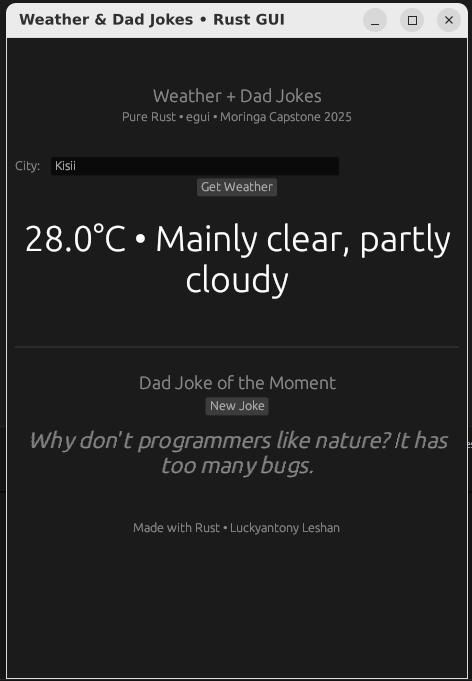

# Rust egui GUI Toolkit: Weather & Dad Jokes Desktop App 🦀

A beginner's toolkit for building native desktop GUIs in **pure Rust** using [egui](https://egui.rs/) (immediate-mode framework). This app fetches real-time weather from Open-Meteo API and generates interactive dad jokes. Built as my Moringa School AI Capstone using GenAI prompts on ai.moringaschool.com — learned Rust async + GUI in 4 days!

**Why Rust + egui?** Zero JS bloat, cross-platform binaries, memory-safe. Perfect for desktop tools (e.g., like Discord's backend).

## ✨ Features
- Enter any city → Instant weather (temp + description).
- Click "New Joke" → Cycles 8 hilarious dad jokes.
- Native window: Resizable, spinner loader, colored errors.
- WSL-friendly (no crashes).

**Demo Output:**  
  
 This demonstrates the complete working app after a successful API call.*

## 🚀 Quick Start
See [QUICKSTART.md](QUICKSTART.md) for detailed setup.

1. Install Rust: `curl --proto '=https' --tlsv1.2 -sSf https://sh.rustup.rs | sh`
2. Clone: `git clone https://github.com/luckyantony/weather-jokes-gui.git && cd weather-jokes-gui`
3. Run: `cargo run`
4. Build release: `cargo build --release` (binary in `target/release/`)

## 📁 Project Structure
- `src/main.rs`: Core app logic (egui update, async fetch).
- `examples/`: Minimal snippets (hello window, API call).
- `PROJECT_SUMMARY.md`: Full Moringa toolkit (overview, prompts, errors).
- `screenshots/`: Visual proofs.

## 🤝 Contributing
Fork & PR! Tested on WSL Ubuntu. Questions? Open issue.

**Moringa School Capstone 2025 • Luckyantony Leshan**  
[Full Toolkit Docs](PROJECT_SUMMARY.md) | [AI Prompts](AI_PROMPTS_USED.md)